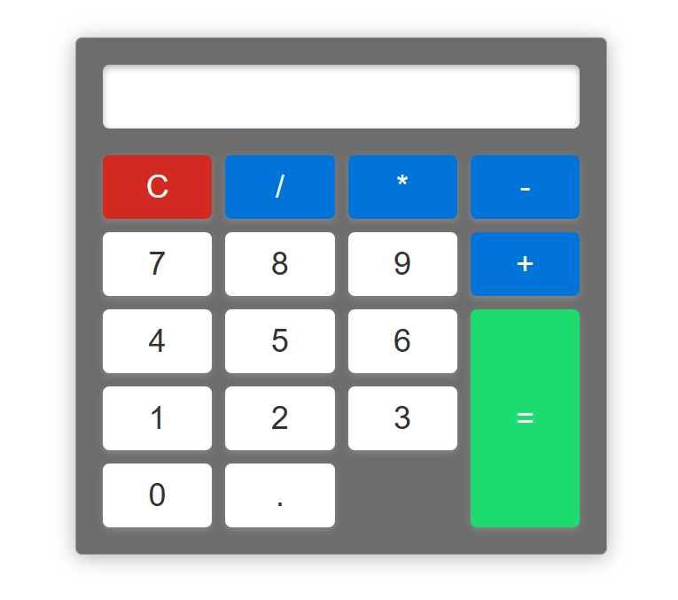

# Basic-Calculator
## Overview
The Calculator App is a simple yet powerful tool for performing basic arithmetic calculations. This application provides a user-friendly interface for performing addition, subtraction, multiplication, and division operations.

## Features
- Basic Arithmetic Operations: Perform addition, subtraction, multiplication, and division calculations with ease.

- Clear Function: Clear the current input or the entire calculation with the clear button.

- User-Friendly Interface: The app offers a straightforward and intuitive interface, making it suitable for users of all levels.

How to Use
- Installation:

Clone this repository to your local machine.

Open the index.html file in your web browser.

- Perform Calculations:

Use the numeric keypad to enter numbers.

Click the arithmetic operation buttons (+, -, *, /) to perform calculations.

- Clear:

Use the "C" button to clear the current input.

- Equals (=):

Click the "=" button to obtain the result of your calculation.